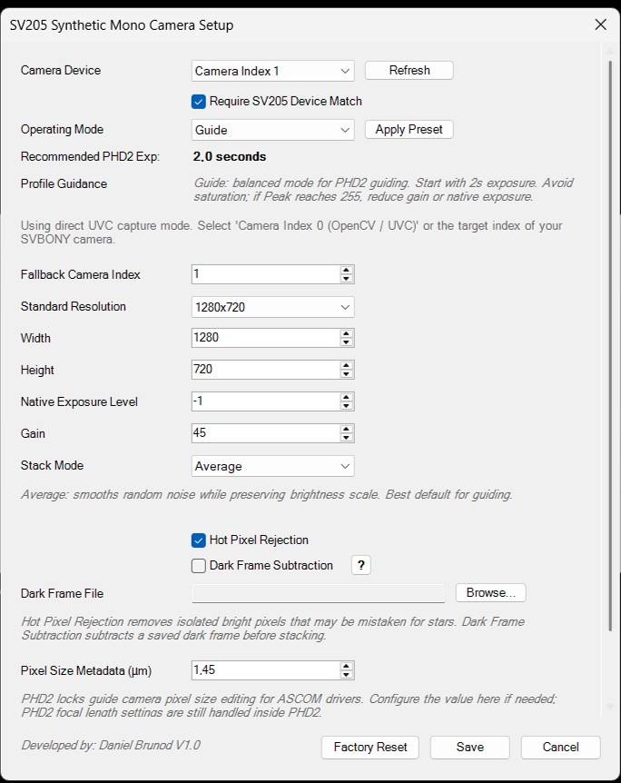
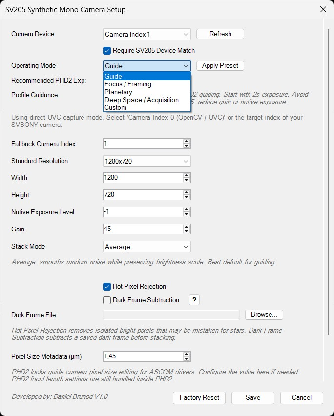
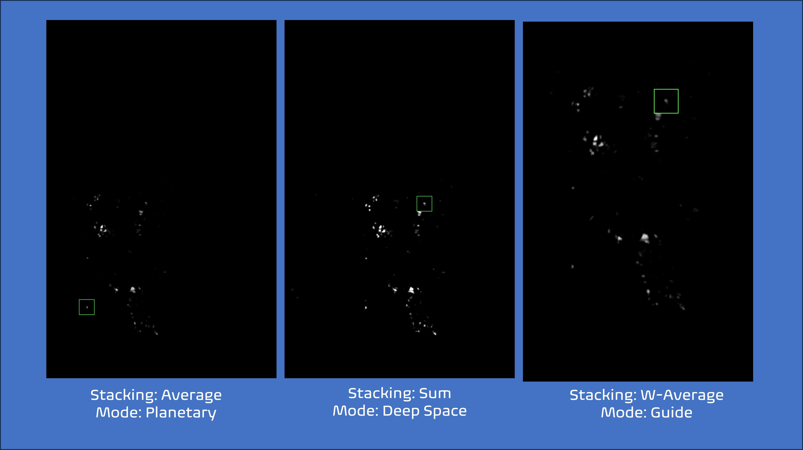
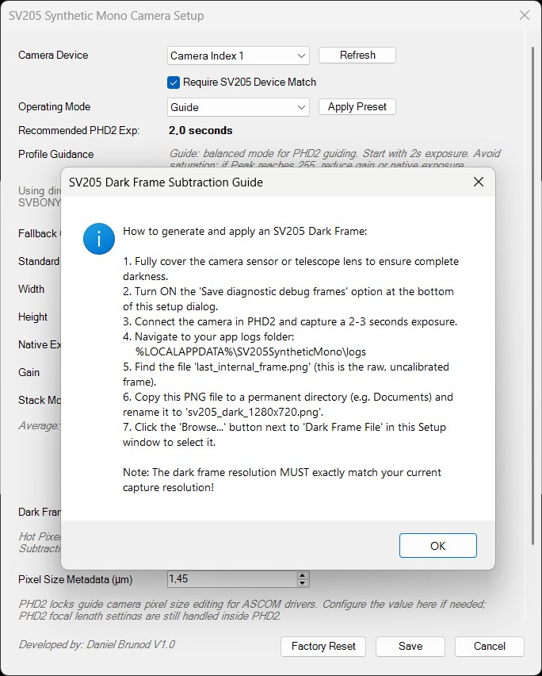

# SV205 Synthetic Mono ASCOM Driver

**SV205 Synthetic Mono ASCOM Driver** is an experimental Windows ASCOM camera driver for using the **SVBONY SV205** camera as a synthetic monochrome guide camera, primarily with **PHD2 Guiding**.

The driver captures frames from the SV205, converts them to grayscale/luma, optionally combines multiple frames through stacking, and exposes the final image to astronomy software through the ASCOM Camera interface.

> Developer: Daniel Brunod  
> Status: Beta / Experimental  
> Target camera: SVBONY SV205  
> Target platform: Windows + ASCOM + PHD2  
> License: Proprietary non-commercial beta license

---

## What this software does

The SVBONY SV205 is commonly exposed to Windows as a UVC / webcam-style camera. PHD2 can use it as a WDM webcam, but the default webcam path has limited control and is not optimized for guide/camera workflows.

This driver wraps the SV205 as an ASCOM-compatible synthetic mono camera. It provides a more controlled path for:

```text
grayscale/luma image
time-based synthetic exposure
frame stacking
guide camera configuration
PHD2 integration
diagnostic logging
```

The goal is to make the SV205 more useful for low-cost guiding experiments, especially when using it with a guide scope and PHD2.

---

## What this software does not do

This driver does **not** turn the SV205 into a true monochrome astronomy camera.

The SV205 is still a color camera physically. The driver produces a monochrome image by using grayscale/luma processing from the captured video stream.

This driver also does not provide official SVBONY SDK support, hardware firmware modification, guaranteed long-exposure camera control, or official support from SVBONY, ASCOM, OpenCV, or PHD2.

---







## Key features

```text
ASCOM Camera driver for Windows
Designed for PHD2 Guiding
SVBONY SV205 targeting and camera selection
Synthetic monochrome / grayscale output
Luma based processing
Time-based exposure capture
Frame stacking
Multiple stacking modes
Hot pixel rejection option
Dark frame subtraction option
Profile / preset operation
Pixel size metadata for PHD2
Diagnostic logging
Full uninstall support
```
**Luma source**

The driver uses the **luma/brightness information extracted from the SV205 video stream**, rather than the color information. The camera exposes a YUYV/YUY2-style video signal, where the **Y component represents luminance**. This is the most useful signal for guiding because PHD2 tracks the position of a star from brightness and centroid shape, not from color. Using luma also avoids unnecessary color processing and provides a simpler, more stable monochrome image for guide/star detection.

**Stacking**

The driver uses stacking to combine all frames captured during the exposure duration requested by PHD2. For example, when PHD2 requests a 3-second exposure, the driver captures frames for approximately 3 seconds, then combines those frames into one final image before marking it ready for PHD2. This allows the SV205 to behave more like a guide camera even though it is internally delivering video frames. Depending on the selected stacking method, the driver can prioritize smoother guiding, brighter faint star acquisition, outlier rejection, or calibrated noise reduction.



---
## Main operating modes

The driver includes configuration profiles for common use cases:

| Profile | Resolution | Native Exposure Level | Gain | Stack Mode | Hot Pixel Rejection | Dark Frame Subtraction | Save Debug Frames | Recommended PHD2 Exposure |
| :--- | :--- | :--- | :--- | :--- | :--- | :--- | :--- | :--- | 
| **Guide** | 1280x720 | -1 | 45 | Average | On | Off | Off | 2.0s | 
| **Focus / Framing** | 1280x720 | -3 | 45 | Average | Off | Off | Off | 0.5s | 
| **Planetary** | 640x480 | -5 | 30 | Average | Off | Off | Off | 0.5s |
| **Deep Space / Acquisition** | 1280x720 | 0 | 80 | Sum or Sigma-clipped average | On | Off by default | Off | 3.0s |
| **Custom** | *Manual* | *Manual* | *Manual* | *Manual* | *Manual* | *Manual* | *Manual* | *Manual* | 

### MODE: Guide

Balanced mode for normal PHD2 guiding.

Recommended starting point:

```text
Stack Mode: Average
Hot Pixel Rejection: On
Dark Frame Subtraction: Off
Recommended PHD2 exposure: 2s
```

### MODE: Focus / Framing

Faster response mode for focusing and framing.

Recommended starting point:

```text
Shorter native exposure
Average stack
Recommended PHD2 exposure: 0.5s
```

### MODE: Planetary

For bright targets such as planets, Moon, or artificial bright targets.

Recommended starting point:

```text
Lower gain
Shorter native exposure
Average stack
Recommended PHD2 exposure: 0.5s
```

### MODE: Deep Space / Acquisition

For finding faint stars and acquiring a usable guide star.

Recommended starting point:

```text
Higher gain
Longer exposure
Sum or Sigma-clipped average
Hot Pixel Rejection: On
Recommended PHD2 exposure: 3s
```

### MODE: Custom

Manual configuration mode for advanced testing.

---

## MODE: Time-based exposure model

The driver uses a **time-based exposure model**.

When PHD2 requests an exposure, for example:

```text
StartExposure(3.0)
```

the driver does not assume that 3 seconds always equals 3 frames.

Instead, it does this:

```text
PHD2 calls StartExposure(duration)
Driver starts a timer
Driver captures frames until elapsed time reaches the requested duration
Driver stacks all captured frames
Driver marks ImageReady = true
PHD2 reads ImageArray
```

This is important because the SV205 frame rate changes depending on the native exposure setting.

For example:

```text
Native Exposure Level 0  → roughly 1 frame per second
Native Exposure Level -6 → many faster frames during the same exposure window
```

To PHD2, both cases are delivered as one completed exposure.

---

## Stacking and image-processing methods

The driver supports, or is designed to support, several frame-combination methods:

```text
Average
Sum
Median
Max
Sigma-clipped average
Weighted average
Dark-subtracted average
```

Additional processing options:

```text
Hot Pixel Rejection: On / Off
Dark Frame Subtraction: On / Off
```

### PROCESSING: Average

Smooths random noise while preserving the brightness scale. This is the recommended default for guiding.

### PROCESSING: Sum

Adds frames together, making faint objects brighter. Useful for acquisition, but it can also increase noise and saturation.

### PROCESSING: Median

Rejects outlier pixels and transient noise. Useful for reducing hot pixels, but it can reduce very faint signals.

### PROCESSING: Max

Keeps the brightest value from all frames. Useful for detection experiments, but not recommended for stable guiding.

### PROCESSING: Sigma-clipped average

Rejects statistical outliers before averaging. Useful when enough frames are captured.

### PROCESSING: Weighted average

Gives more influence to frames estimated to be cleaner or better. Experimental.

### PROCESSING: Dark-subtracted average

Subtracts a compatible dark frame before averaging. Useful for fixed pattern noise and thermal artifacts.

**Obs — requirement:** This method requires a dark frame captured with the same camera configuration used for the light frames, including resolution, native exposure level, gain, stacking context, and preferably similar sensor temperature/USB conditions. If no compatible dark frame is available the driver fall back to normal Average stacking, or keep Dark Frame Subtraction disabled until a valid dark frame is configured.


---

## Camera selection

The driver is designed to target the SVBONY SV205 specifically.

The setup dialog should show connected video devices, such as:

```text
SVBONY SV205 [index 1]
Integrated Webcam [index 0]
OBS Virtual Camera [index 2]
```
OBS: In the Menu, the user does not see the NAMES of the devices, just the Index. So you need to test in case you have a webcan or other cameras connected. This is a limitation from the DLLs used in this project. 

The driver can be configured to require an SV205 match so it does not accidentally open an integrated laptop webcam.


---

## Pixel size metadata

When an ASCOM camera is selected, PHD2 may disable manual pixel-size editing and use the value reported by the ASCOM driver.

For this reason, the driver setup includes:

```text
Pixel Size Metadata (µm)
```

The default value is:

```text
1.4 µm - But be aware some SV205 have a 1.45 µm pixel size. 
```

Guide scope focal length should still be configured in PHD2.

---

## Diagnostics and logs

The driver writes diagnostic logs under:

```text
%LOCALAPPDATA%\SV205SyntheticMono\logs\
```

The log includes:

```text
selected camera device
frame dimensions
capture duration
number of captured frames
stacking method
hot pixel / dark frame settings
ImageReady timing
ImageArray dimensions
PHD2 exposure behavior
```

The driver may also save debug frames when enabled:

```text
last_internal_frame.png
last_ascom_frame.png
```

These are useful for diagnosing whether a display issue is caused by capture/conversion or by ASCOM ImageArray formatting.

---

## Requirements

Recommended environment:

```text
Windows 10 or newer
ASCOM Platform installed
PHD2 Guiding installed
SVBONY SV205 connected by USB
```

## Requirement: ASCOM Platform

This driver requires the ASCOM Platform to be installed before use.

The installer registers the SV205 Synthetic Mono Camera driver, but it does not replace or embed the ASCOM Platform runtime. PHD2 uses the ASCOM Platform to discover, configure, and instantiate ASCOM camera drivers.

Install ASCOM Platform first, then install this driver.

If your PHD2 installation is under:

```text
C:\Program Files (x86)\PHDGuiding2\
```

the ASCOM driver must be installed/registered as an x86-compatible COM driver.

The installer provided with the release already handles this.

---

## Download and installation

1. Download the latest release installer:

```text
SV205SyntheticMonoSetup.exe
```

2. Close PHD2 and any software that may be using the SV205:

```text
PHD2
SharpCap
Windows Camera
OBS
Teams / Zoom / Discord
Other capture software
```

3. Run the installer as Administrator.

4. Read and accept the beta disclaimer.

5. Complete the installation.

6. Open PHD2.

7. Select:

```text
Camera: ASCOM Camera
Driver: SV205 Synthetic Mono Camera
```

8. Open the ASCOM driver setup dialog and confirm:

```text
Camera Device: SVBONY SV205
Operating Mode: Guide
Pixel Size Metadata: 1.4 µm
Stack Mode: Average
```

9. Start with a fixed PHD2 exposure of 2 seconds.

---

## Uninstall

Use Windows Apps / Installed Apps to uninstall:

```text
SV205 Synthetic Mono ASCOM Driver
```

The uninstaller does:

```text
unregister the ASCOM COM driver
remove installed driver files
remove the installation folder
remove local driver settings and logs, if full cleanup is enabled
remove the Windows uninstall entry
```

If Windows reports a missing `unins000.exe`, an older development build may have left a stale uninstall entry. Use the cleanup instructions in the project documentation before reinstalling.

---

## Recommended first test

For initial PHD2 testing:

```text
Operating Mode: Guide
Stack Mode: Average
Hot Pixel Rejection: On
Dark Frame Subtraction: Off
Native Exposure Level: -1 or 0
Gain: 45 to 64
PHD2 Exposure: 2s
Subframes: Off initially
PHD2 Noise Reduction: Off initially
```

If the star is saturated:

```text
reduce gain
use a shorter native exposure level
avoid Sum stacking
```

If the star is too weak:

```text
increase gain
try 3s exposure
try Deep Space / Acquisition mode
use Sum only for acquisition if needed
```

---

## Beta status and limitations

This software is beta/testing software.

Known limitations may include:

```text
experimental camera capture behavior
dependency on DirectShow / OpenCV behavior
possible camera index differences between systems
limited hardware control compared with a native astronomy SDK
possible PHD2-specific behavior around pixel size and ASCOM properties
debugging required for some systems
```

Use this software for testing and experimentation. Validate carefully before using it in the field.

---

## License

This project is distributed under a proprietary non-commercial beta license.

Free personal and non-commercial astronomy/testing use is permitted. Commercial use, modification, reverse engineering, and redistribution of modified versions are not permitted without written permission from Daniel Brunod.

See `LICENSE.md` for full terms.

Third-party components remain subject to their own licenses. See `THIRD_PARTY_NOTICES.md`.

---

## Third-party components

This project may include, reference, or depend on:

```text
ASCOM Platform components
OpenCvSharp / OpenCV
Newtonsoft.Json
Microsoft .NET Framework
```

 Third-party components remain subject to their own licenses. See [`License - Third-Party Notices.md`](License - Third-Party Notices.md).

---

## Disclaimer

This software is experimental beta software.

It may contain bugs, limitations, or unexpected behavior. It may fail to connect, capture, guide, calibrate, stack, process images, or operate correctly.

The software is provided as-is, without warranty of any kind. Daniel Brunod is not responsible for equipment damage, mount behavior, telescope behavior, camera behavior, data loss, guiding errors, imaging loss, missed observations, corrupted files, failed sessions, personal injury, property damage, or misuse of the software.

You are responsible for validating the software safely in your own environment before using it in the field.

---

## Author

**Daniel Brunod**

